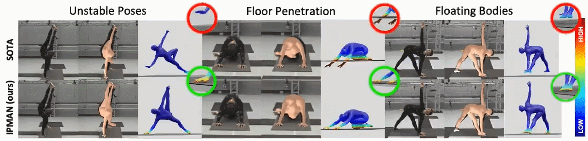

# Intuitive Physics-Based Humans - Regression (IPMAN-R) [CVPR-2023] 

> Code repository for the paper:  
> [**3D Human Pose Estimation via Intuitive Physics**](https://arxiv.org/abs/2303.18246)  
> [Shashank Tripathi](https://sha2nkt.github.io), [Lea M&uuml;ller](https://ps.is.mpg.de/person/lmueller2), [Chun-Hao Paul Huang](https://ps.is.mpg.de/person/chuang2), [Omid Taheri](https://www.is.mpg.de/person/otaheri), [Michael J. Black](https://ps.is.tuebingen.mpg.de/person/black), [Dimitrios Tzionas](https://ps.is.tuebingen.mpg.de/person/dtzionas)  
> *IEEE Computer Vision and Pattern Recognition (CVPR), 2023*

[[Project Page](https://ipman.is.tue.mpg.de)] [[Paper](https://arxiv.org/abs/2303.18246)] [[Video](https://www.youtube.com/watch?v=Dufvp_O0ziU)] [[Poster](https://drive.google.com/file/d/1n8QeOI_WRqcVDUMrB-lG2NCJURhBjppG/view?usp=sharing)] [[Data (MoYo)](https://moyo.is.tue.mpg.de/)] [[License](https://ipman.is.tue.mpg.de/license.html)] [[Contact](mailto:ipman@tue.mpg.de)]



## Installation instructions

IPMAN-R has been implemented and tested on Ubuntu 20.04 with python >= 3.7.

Clone the repository and install the requirements. 
```
git clone https://github.com/sha2nkt/ipman-r.git
cd ipman-r
conda create -n ipman_p37 python=3.7
pip install -U pip
pip install torch==1.1.0 torchvision==0.3.0
pip install neural-renderer-pytorch
pip install -r requirements.txt
```

After finishing with the installation, you can continue with running the demo/evaluation/training code.
In case you want to evaluate our approach on Human3.6M, you also need to manually install the [pycdf package of the spacepy library](https://pythonhosted.org/SpacePy/pycdf.html) to process some of the original files. If you face difficulties with the installation, you can find more elaborate instructions [here](https://stackoverflow.com/questions/37232008/how-read-common-data-formatcdf-in-python).

## Fetch data
We provide a script to fetch the necessary data for training and evaluation. You need to run:
```
chmod +x fetch_data.sh
./fetch_data.sh
```
The GMM prior is trained and provided by the original [SMPLify work](http://smplify.is.tue.mpg.de/), while the implementation of the GMM prior function follows the [SMPLify-X work](https://github.com/vchoutas/smplify-x). Please respect the license of the respective works.

Besides these files, you also need to download the *SMPL* model. You will need the [neutral model](http://smplify.is.tue.mpg.de) for training and running the demo code, while the [male and female models](http://smpl.is.tue.mpg.de) will be necessary for evaluation on the 3DPW dataset. Please go to the websites for the corresponding projects and register to get access to the downloads section. In case you need to convert the models to be compatible with python3, please follow the instructions [here](https://github.com/vchoutas/smplx/tree/master/tools).

Due to license restrictions, we are unable to release Human3.6M SMPL fits. If you want to train on Human3.6M, you need to download the [original dataset](http://vision.imar.ro/human3.6m/description.php) and run the [MoSh code](http://mosh.is.tue.mpg.de/) to obtain the SMPL parameters. Models trained without Human3.6M can still be used for evaluation, but will not be able to achieve the same performance.

## Run IPMAN-R evaluation
We provide code to evaluate our models on the datasets we employ for our empirical evaluation. We provide the required npzs. For details on how we obtain the npzs, please follow the [details for data preprocessing](datasets/preprocess/README.md).

Example usage:
```
python eval.py --checkpoint data/ipman_checkpoints/2022_03_01-06_31_55_epoch1_stepcount_24000.pt --dataset rich-test --log_freq=20 --vis_path 'dummy'
```

To also evaluate stability metrics, please add the `--eval_stability` flag.
```
python eval.py --checkpoint data/ipman_checkpoints/2022_03_01-06_31_55_epoch1_stepcount_24000.pt --dataset rich-test --log_freq=20 --vis_path 'dummy' --eval_stability
```


Running the above command will compute the MPJPE and Reconstruction Error on the Human3.6M dataset (Protocol I). The ```--dataset``` option can take different values based on the type of evaluation you want to perform:
1. RICH ```--dataset=rich-test```
2. Human3.6M Protocol 1 ```--dataset=h36m-p1```
3. Human3.6M Protocol 2 ```--dataset=h36m-p2```
4. 3DPW ```--dataset=3dpw```
5. LSP ```--dataset=lsp```
6. MPI-INF-3DHP ```--dataset=mpi-inf-3dhp```


You can also save the results (predicted SMPL parameters, camera and 3D pose) in a .npz file using ```--result=out.npz```.

For the MPI-INF-3DHP dataset specifically, we include evaluation code only for MPJPE (before and after alignment). If
you want to evaluate on all metrics reported in the paper you should use the official MATLAB test code provided with the
dataset together with the saved detections.

## Run training code
Due to license limitiations, we cannot provide the SMPL parameters for Human3.6M (recovered using [MoSh](http://mosh.is.tue.mpg.de)). Even if you do not have access to these parameters, you can still use our training code using data from the other datasets. Again, make sure that you follow the [details for data preprocessing](datasets/preprocess/README.md).

Example usage:
```
python train.py --cfg config.yaml 
```
You can view the full list of command line options in config.yaml. The default values are the ones used to train the models in the paper. We used Human3.6M, LSP, MPI-INF-3DHP, LSPET, COCO, MPII and RICH to train the final model. 

Running the above command will start the training process. It will also create the folders `logs` and `logs/train_example` that are used to save model checkpoints and Tensorboard logs.
If you start a Tensborboard instance pointing at the directory `logs` you should be able to look at the logs stored during training.

## Citing
If you find this code useful for your research or the use data generated by our method, please consider citing the following paper:

```bibtex
@inproceedings{tripathi2023ipman,
    title = {{3D} Human Pose Estimation via Intuitive Physics},
    author = {Tripathi, Shashank and M{\"u}ller, Lea and Huang, Chun-Hao P. and Taheri Omid
    and Black, Michael J. and Tzionas, Dimitrios},
    booktitle = {Proceedings of the IEEE/CVF Conference on Computer Vision and Pattern
    Recognition (CVPR)},
    month = {June},
    year = {2023}
}
```

## License

See [LICENSE](LICENSE).

## Acknowledgments

This code is heavily derived from [SPIN](https://github.com/nkolot/SPIN) from Kolotouros et al. We also thank Tsvetelina Alexiadis, Taylor McConnell, Claudia Gallatz, Markus Höschle, Senya Polikovsky, Camilo Mendoza, Yasemin Fincan, Leyre Sanchez and Matvey Safroshkin for data collection, Giorgio Becherini for MoSh++, Joachim Tesch and Nikos Athanasiou for visualizations, Zincong Fang, Vasselis Choutas and all of Perceiving Systems for fruitful discussions. This work was funded by the International Max Planck Research School for Intelligent Systems (IMPRS-IS) and in part by the German Federal Ministry of Education and Research (BMBF), Tübingen AI Center, FKZ: 01IS18039B.

## Contact

For technical questions, please create an issue. For other questions, please contact `ipman@tue.mpg.de`.

For commercial licensing, please contact `ps-licensing@tue.mpg.de`.
